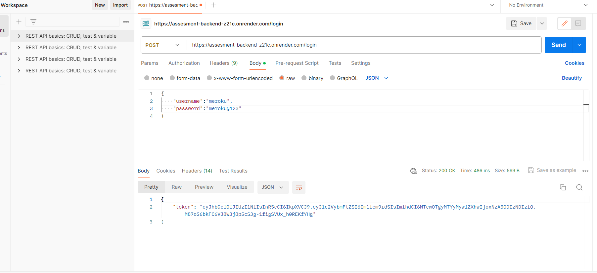
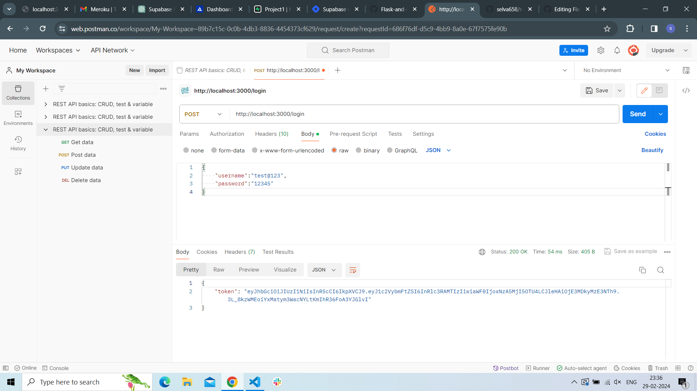
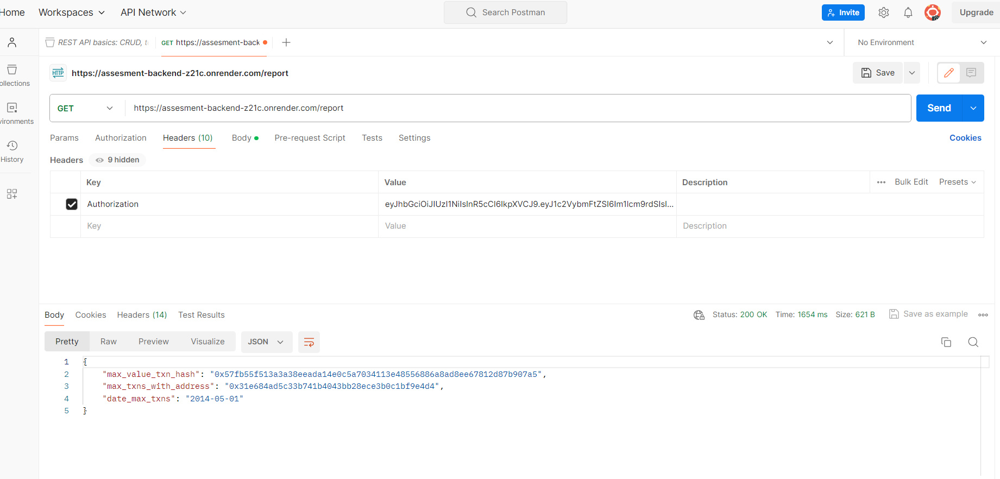
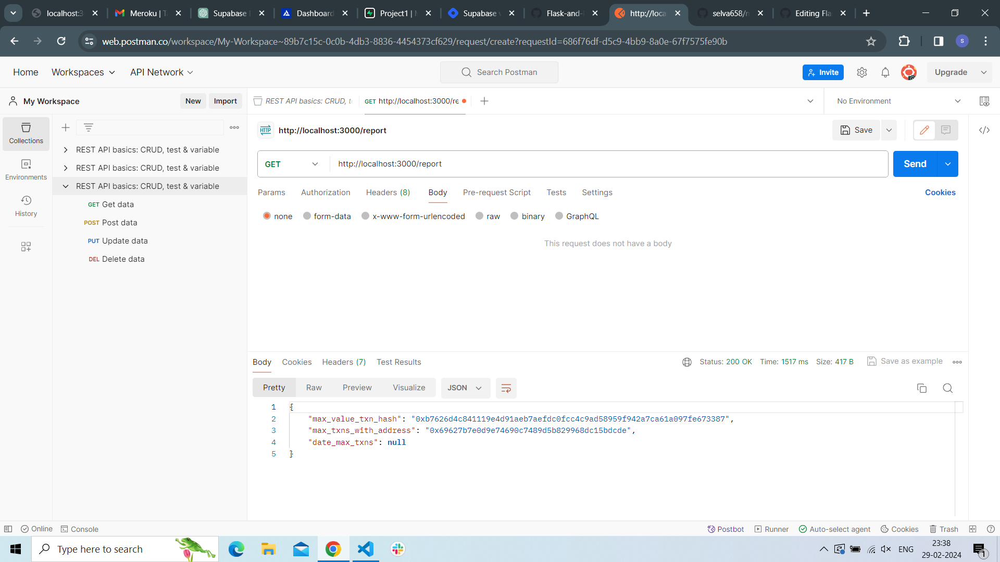

# Packages Required

  - npm install <b>or</b> npm install @supabase/supabase-js alchemy-sdk body-parser dotenv express jsonwebtoken util nodemon 

# Running the app
 
  - npm start 

# Use Postman for testing the Endpoint

  - [postman](https://web.postman.co/workspace/My-Workspace~89b7c15c-0c0b-4db3-8836-4454373cf629/request/create?requestId=7d39237e-5df3-4533-8f74-57e389f21211) 

#  Login and get the JWT Token

  - Utilize the POST method with the endpoint https://assesment-backend-z21c.onrender.com/login (or) http://localhost:3000/login.

  - Within the <b>Body</b> section, select the <b>raw</b> format and choose <b>JSON</b>.

  - Input the username as test@123 and the password as 12345:

  - {"username":"test@123","password":"12345"}

  - Click on send,copy the response JWT Token

  

  

  # Fetch Transaction

  - Access the endpoint http://localhost:3000/fetch-transaction using the GET method.

  - Within the <b>Headers</b> section, include the key as <b>Authorization</b> and the value as the <b>Copied JWT token</b>.
    - If <b>Token is invalid!</b>, please login in again with same cred.

   # Get Reports

  - Access the endpoint https://assesment-backend-z21c.onrender.com/report (or) http://localhost:3000/report using the GET method.

  - Within the <b>Headers</b> section, include the key as <b>Authorization</b> and the value as the <b>Copied JWT token</b>.
    - If <b>Token is invalid!</b>, please login in again with same cred.

    
    

 
